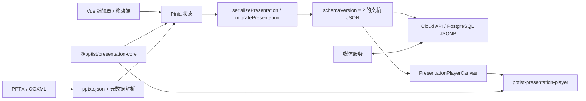

# PPTist 开发指南

本指南描述当前仓库的实际工程结构、数据流和开发约束，面向开发人员和后续 AI。
项目功能介绍见 [`README_zh.md`](../README_zh.md)，生产部署见
[`DEPLOYMENT.md`](../DEPLOYMENT.md)。

## 1. 项目总览

PPTist 是一个 Vue 3 + TypeScript 的 Web 幻灯片编辑器。本 Fork 额外包含：

- 单用户云文稿、PostgreSQL 持久化、Session 登录和乐观锁；
- 服务端媒体代理和加密保存的媒体 API Key；
- 与 Vue 解耦的动画、Morph、PPTX 元数据核心；
- 可独立发布、无框架依赖的 DOM 播放器；
- 版本化演示文稿 JSON、兼容性审计和资源可移植性审计。

推荐开发环境为 Node.js 22 和 npm。播放器包声明的最低运行版本是 Node.js 18，
但仓库 CI、构建和后端统一以 Node.js 22 验证。

## 2. 总体架构



关键边界：

- `src/` 是编辑器、移动端、云文稿 UI 和 Vue 适配层。
- `packages/presentation-core` 是无 UI 的领域内核，不得导入 Vue、Pinia 或编辑器组件。
- `packages/presentation-player` 是正式播放实现，不依赖 Vue，通过 DOM、Web Animations、
  ECharts SVG 和浏览器原生媒体工作。
- `backend/` 是独立 Node.js HTTP 服务，文稿内容以 JSONB 保存到 PostgreSQL。
- 编辑器预览先由 `serializePresentation()` 生成正式 JSON，再通过工作区安装包
  `pptist-presentation-player` 播放。不要在编辑器里维护第二套播放语义。

## 3. 目录地图

| 路径 | 职责 | 常见入口 |
| --- | --- | --- |
| `src/main.ts`、`src/App.vue` | 应用启动、登录/编辑/放映/移动端分流 | `src/App.vue` |
| `src/store/` | Pinia 编辑状态、云文稿、播放状态、撤销重做 | `slides.ts`、`documents.ts` |
| `src/types/` | 编辑器使用的页面、元素和业务类型 | `slides.ts`、`cloud.ts` |
| `src/views/Editor/` | 桌面编辑器、画布、面板和工具栏 | `index.vue`、`Canvas/`、`Toolbar/` |
| `src/views/Screen/` | 播放器 Vue 生命周期适配、演讲者和观众视图 | `PresentationPlayerCanvas.vue` |
| `src/views/Mobile/` | 移动端编辑和预览 | `index.vue` |
| `src/views/components/element/` | 各元素在编辑器中的渲染组件 | `*Element/` |
| `src/hooks/` | 跨组件编辑操作和导入导出流程 | `useImport.ts`、`useExport.ts` |
| `src/utils/presentation.ts` | 正式文稿创建、序列化、迁移和应用 | `serializePresentation()` |
| `src/configs/` | 动画、字体、形状、快捷键等静态配置 | `animation.ts` |
| `packages/presentation-core/` | schema、PPTX 元数据、动画、Morph、播放游标 | `src/index.ts` |
| `packages/presentation-player/` | 独立 DOM 渲染器和播放器公共 API | `src/index.ts`、`src/player.ts` |
| `backend/` | 身份认证、文稿 CRUD、媒体代理、数据库初始化 | `index.mjs` |
| `scripts/` | 清理、迁移、播放器打包、统一产物装配 | `assemble-dist.mjs` |
| `doc/`、`docs/` | 专题说明和当前工程文档 | `docs/README.md` |

`dist/`、`.build/`、`release/`、`packages/presentation-player/dist/` 和
`*.tsbuildinfo` 都是生成产物，不应作为源码修改。

## 4. 本地开发

### 4.1 安装依赖

在仓库根目录执行：

```bash
npm ci
```

只在主动修改依赖时使用 `npm install`，并提交同步更新的 `package-lock.json`。

### 4.2 启动前端

```bash
npm run dev
```

`predev` 会先构建播放器，因此播放器源码修改能进入编辑器实际使用的 `dist` 入口。
Vite 默认监听 `http://127.0.0.1:5173/`；端口被占用时会顺延。若端口变化，后端的
`PPTIST_ALLOWED_ORIGIN` 也必须使用实际地址。

### 4.3 启动云文稿后端

编辑器当前会在启动时检查云端 Session，完整本地开发需要可访问的 PostgreSQL 和后端。
以 [`backend/local.env.example`](../backend/local.env.example) 为模板创建忽略提交的
`backend/local.env`，填入本地数据库和密钥。

后端不会自动加载 `.env`。PowerShell 7 可在独立终端中执行：

```powershell
Get-Content backend/local.env | ForEach-Object {
  if ($_ -match '^\s*([^#][^=]*)=(.*)$') {
    [Environment]::SetEnvironmentVariable($matches[1].Trim(), $matches[2], 'Process')
  }
}
npm run cloud-server
```

Bash 可执行：

```bash
set -a
source backend/local.env
set +a
npm run cloud-server
```

健康检查为 `GET http://127.0.0.1:3175/api/cloud/health`。后端启动时会创建或补齐
PostgreSQL 表；首次创建用户时必须提供 `scrypt$...` 格式的管理员密码哈希。

### 4.4 常用命令

| 命令 | 用途 |
| --- | --- |
| `npm run dev` | 构建播放器后启动 Vite 开发服务器 |
| `npm run cloud-server` | 启动云文稿 API |
| `npm run test:core` | 运行领域核心测试 |
| `npm run test:player` | 运行播放器单元和 DOM 测试 |
| `npm run check:docs` | 检查仓库内 Markdown 本地链接 |
| `npm run type-check` | 运行 Vue/TypeScript 类型检查 |
| `npm run lint` | 自动修复并检查整个仓库的 ESLint 问题 |
| `npm run build:player` | 生成播放器 `dist` |
| `npm run verify:player-package` | 验证构建入口和独立消费者安装 |
| `npm run build-only` | 只构建前端到 `.build/frontend` |
| `npm run build` | 生成完整 `dist/` 和播放器离线包 |
| `npm run clean` | 删除受控生成产物 |

`npm run lint` 带 `--fix`，可能改动大量文件。日常修改优先对涉及文件执行定向 ESLint，
全仓修复前先检查工作区。

## 5. 文稿数据与状态

### 5.1 编辑状态

`src/store/slides.ts` 是编辑内容的主状态：

- `title`、`theme`：文稿标题和主题；
- `slides`：页面、元素、动画、转场、备注和批注；
- `slideIndex`：当前编辑/播放页；
- `viewportSize`、`viewportRatio`：逻辑画布宽度和宽高比；
- `templates`：编辑器模板列表，不属于正式保存内容。

默认逻辑画布为 `1000 × 562.5`。元素坐标和尺寸均基于逻辑画布，编辑画布、缩略图和
播放器只改变整体缩放，不应把屏幕像素反写为文稿坐标。

`src/store/main.ts` 保存选择、画布缩放、面板开关等临时 UI 状态；
`src/store/documents.ts` 管理登录、文稿列表、脏状态、保存和 revision；
`src/store/snapshot.ts` 使用 IndexedDB 保存最多 20 个撤销/重做快照。

### 5.2 正式 JSON

唯一序列化入口是 `src/utils/presentation.ts`：

- `createBlankPresentation()` 创建版本化空文稿；
- `serializePresentation()` 从 Pinia 生成不含 Proxy 的稳定 JSON 快照；
- `migratePresentation()` 接受旧版本数据并迁移到当前 schema；
- `applyPresentation()` 将正式文稿安全应用到编辑状态。

当前 `schemaVersion` 为 2，由 `packages/presentation-core/src/types.ts` 定义。正式文稿包含
标题、画布尺寸、主题、页面和最后播放页。新增持久化字段时必须同时处理：

1. 编辑器类型和默认值；
2. 旧文稿迁移；
3. 播放器类型、校验和兼容性；
4. JSON 导入/导出及云保存；
5. 测试、公共声明和文档。

不要从组件或云服务手工拼装另一种文稿结构。

### 5.3 元素身份

每个页面元素都有页面内唯一 `id`。与平滑关联有关的字段是：

- `name`：用户或 PPTX 中的对象名称；
- `source`：导入 PPTX 的 `slideIndex`、`shapeId`、`creationId` 等来源信息；
- `morphKey`：编辑器记录的跨页稳定身份。

同页复制表示新对象，应生成新的身份；跨页复制或复制整页表示对象延续，应保留或派生
稳定 `morphKey`。统一使用 `presentationMorphKeyForCopy()`，不要在粘贴逻辑中自行猜测。

## 6. 编辑器开发约定

### 6.1 数据修改

- 内容修改优先通过 `useSlidesStore()` action 完成，让云文稿脏状态追踪能观察到操作。
- 完成一个用户可撤销的编辑动作后，通过 `useHistorySnapshot()` 添加历史快照。
- 页面切换、模板加载等非内容状态不要制造无意义保存或撤销记录。
- 批量改 ID 时必须同步更新组合、动画目标、页面链接和 Morph 页面对关联。
- 不要原地复用来自剪贴板、模板或外部 JSON 的对象；先深拷贝，再生成新 ID。

### 6.2 新增或修改元素类型

至少检查以下位置：

1. `src/types/slides.ts` 的元素联合类型；
2. `src/views/components/element/` 的基础渲染和编辑渲染；
3. `src/views/Editor/Canvas/EditableElement.vue` 及工具栏路由；
4. 缩略图、移动端、导入、导出和复制逻辑；
5. `packages/presentation-player/src/renderer.ts` 和公共类型；
6. 兼容性矩阵、资源审计和 DOM 测试；
7. `doc/AI_PPT_SCHEMA.md` 与 `doc/CustomElement.md`。

编辑器能显示并不等于独立播放器能交付，两个入口都必须验证。

### 6.3 富文本

文本内容是 HTML，编辑器使用 ProseMirror。外部不可信文稿必须由宿主通过播放器的
`sanitizeHtml` 清理。改变富文本结构时要同时检查编辑器、缩略图、播放器、文本 Morph、
PPTX 导入导出和 JSON 迁移。

## 7. 动画、时间线与 Morph

### 7.1 双层动画表示

`Slide.animationTimeline` 是框架无关的正式时间线，使用：

- `click`：等待用户触发；
- `withPrevious`：与上一事件同时；
- `afterPrevious` / `auto`：上一事件完成后自动开始。

`Slide.animations` 是编辑器兼容层，分别使用 `click`、`meantime`、`auto`。PPTX 导入会保存
正式时间线，并生成兼容动画供现有编辑器面板使用。不要在不同播放器里分别解释触发语义；
统一由 `packages/presentation-core/src/player.ts` 的 `compileAnimationSteps()` 和
`PresentationPlayerController` 编译步骤。

进入新页面时：

- 首动画为 `withPrevious`：与页面转场同时开始；
- 首动画为 `afterPrevious`：等待转场结束后开始；
- 首动画为 `click`：转场后保持等待；
- 连续自动步骤按 `autoAdvance` 链执行。

滚轮、键盘和点击调用的是同一播放游标。滚轮一手势最多推进一个动画步骤：播放过程中滚动
先立即完成当前步骤，空闲时再推进下一步骤，只有当前页步骤耗尽后才翻页。

### 7.2 动画效果

效果名称、方向和编辑器选项在 `src/configs/animation.ts`；规范化、关键帧计划和旧效果映射在
`packages/presentation-core/src/effects.ts`；DOM 执行在 core 的 `browser.ts` 和播放器中。
增加效果时必须同时检查入场/退场/强调分类、方向、终态、反向播放、延迟、重复和降级行为。

### 7.3 Morph 关联规则

Morph 配置属于目标页的 `Slide.transition.morph`，表示“从上一页到当前页”的关系：

- `links`：用户手工建立的对象对，优先级最高，允许不同元素类型通过交叉淡化连接；
- `excludedToElementIds`：用户明确取消关联的目标对象，自动匹配不得恢复；
- 唯一的同类型 `!!名称`：PowerPoint 风格强制关联；
- `morphKey`、PPTX `creationId`、相同元素 `id`：稳定身份信号；
- `shapeId`、普通名称、内容、外观、位置和尺寸：自动评分的辅助信号。

自动评分阈值当前为 80。稳定身份可直接匹配；纯启发式匹配必须达到阈值且不能并列。明确存在
不同 `morphKey` 时视为不同对象，位置或外观相似不能覆盖用户身份。真实规则以
`packages/presentation-core/src/morph.ts` 和对应测试为准。

选择窗格是建立、取消和切换手工关联的编辑入口。只有当前页转场为 Morph 时才展示关联状态。
手工关联选择上一页对象后，应回到原页并写入当前页的 `links`；取消时写入排除项，避免自动
评分重新连接。

### 7.4 Morph 渲染

播放器使用对象几何变换、交叉淡化和文字 Morph。`byWord` / `byChar` 模式由
`packages/presentation-player/src/textMorph.ts` 进行分词、匹配和光流画布过渡。完全未变化的
匹配对象通过 `presentationMorphNeedsAnimation()` 跳过合成动画，避免开始/结束时重新栅格化
造成闪烁或位移。

修改 Morph 时至少运行 core Morph 测试、player 文本 Morph/DOM 测试，并在真实浏览器中验证：

- 不变对象不闪烁；
- 文字内容、颜色、字号和容器尺寸变化；
- 图片、形状、线条的移动、缩放和旋转；
- 手工关联、取消、切换和复制后的身份；
- 快速滚轮抢占与连续翻页。

当前正式放映路径在 `packages/presentation-player`。仓库里若存在未被组件引用的旧 Vue 播放
helper，不应被当作行为规范或单独修补。

## 8. PPTX 导入

PPTX 导入由两条信息流合并：

- `pptxtojson` 解析可见元素、布局和大部分样式；
- `packages/presentation-core/src/pptx.ts` 直接读取 OOXML，保留转场、时间节点、Shape ID、
  Creation ID、名称和动画原始信息。

`src/utils/pptxImport.ts` 将来源身份映射到编辑器元素；`src/hooks/useImport.ts` 负责创建页面、
解析元素、解析动画目标和生成兼容动画。新增导入能力时应尽量保留无法完整解释的原始元数据，
并给出明确的 approximate/unsupported 兼容级别，而不是静默丢弃。

导入还原不等于导出回写。涉及 PPTX 的问题必须分别标注“导入、编辑器渲染、播放器渲染、
PPTX 导出”中的哪一层。

## 9. 独立播放器

公共入口为 `packages/presentation-player/src/index.ts`，主要 API 包括：

- `createPresentationPlayer()` / `DomPresentationPlayer`；
- `readPlayerDocument()`、schema 校验；
- `analyzePresentationCompatibility()`；
- `analyzePresentationResources()`；
- 时间线、图表、图片和资源辅助 API。

播放器必须保持框架无关，不得导入 `src/`、Vue、Pinia 或私有工作区运行时。公共 API 变更时
同步维护 `src/public.d.ts`、包 README、使用指南、构建验证和独立消费者验证。

根应用依赖的是播放器正式包名和已构建 `dist`，而不是 Vite 源码别名。因此修改播放器后，
在浏览器检查前至少执行：

```bash
npm run build:player
npm run test:player
```

完整外部交付契约见 [播放器架构](./presentation-player-architecture.md) 和
[播放器使用指南](./presentation-player-usage.md)。

## 10. 云文稿、数据库与媒体

后端是单用户 Node.js HTTP API：

- Cookie 中保存随机 Session Token，数据库只保存 SHA-256 哈希；
- 密码使用带随机盐的 scrypt 哈希；
- 文稿内容保存在 PostgreSQL `presentations.content_json` JSONB；
- 保存请求携带 `revision`，条件更新失败返回 `409 version_conflict`；
- 删除是 `deleted_at` 软删除；
- 媒体 API Key 使用 AES-256-GCM 加密后存储；
- 文件上传经 `/api/cloud/documents/{id}/media` 流式代理到外部媒体服务。

浏览器中的 Blob URL 不能持久交付。保存前，`src/services/media.ts` 会物化待上传媒体并把
文稿中的临时资源替换为长期 URL。不要把数据库 URL、密码哈希、Session、媒体 API Key、
凭据密钥、数据库文件或真实 `backend/local.env` 提交到 Git。

API、环境变量和生产配置分别见 [`backend/README.md`](../backend/README.md) 与
[`DEPLOYMENT.md`](../DEPLOYMENT.md)。

## 11. 测试与验收

按修改范围选择最低验证集：

| 修改范围 | 最低验证 |
| --- | --- |
| 文档 | `npm run check:docs`、`git diff --check`，人工检查命令 |
| 普通 Vue/TS 编辑器 | 定向 ESLint、`npm run type-check`、`npm run build-only` |
| core 类型/动画/Morph/schema | `npm run test:core`、`npm run type-check` |
| 播放器渲染或 API | `npm run test:core`、`npm run test:player`、`npm run build:player` |
| 播放器发布契约 | 上述测试加 `npm run verify:player-package` |
| 完整发布 | `npm run clean` 后运行 core/player 测试、包验证和 `npm run build` |
| 后端 | 对修改的 `.mjs` 做语法检查，并用真实 PostgreSQL 验证 health、登录和相关 API |

UI、动画和 Morph 不能只靠单元测试。需要在真实 Chromium 浏览器中检查布局、交互、动画终态、
快速连续输入、页面缩放和字体栅格差异。截图基准范围见
[播放器兼容基准](./presentation-player-compatibility.md)。

## 12. 构建、发布与部署

`npm run build` 的主要阶段：

1. 构建播放器到 `packages/presentation-player/dist`；
2. 类型检查；
3. 构建前端到 `.build/frontend`；
4. `npm pack` 播放器到 `release/` 并生成 SHA-256；
5. `scripts/assemble-dist.mjs` 原子装配统一 `dist/`。

最终目录：

```text
dist/
├── public/                 # Nginx 静态根目录
│   └── downloads/          # 播放器 tgz、SHA256 和使用指南
└── backend/                # 生产 Node.js 后端源码
```

GitHub Actions：

- 推送 `master`：Node.js 22 构建并发布 `dist/public` 到 GitHub Pages；
- 推送 `presentation-player-v*` 标签：测试、打包并创建 GitHub Release；
- 手动运行播放器工作流并启用 `publish_npm`：发布到 npm，需要 `NPM_TOKEN`。

不要手工编辑或复用旧 `dist/` / `release/`。生产部署流程以
[`DEPLOYMENT.md`](../DEPLOYMENT.md) 为准。

## 13. 代码与提交规范

- Vue 3 Composition API，组件优先使用 `<script setup lang="ts">`。
- TypeScript 开启类型检查；公共边界优先显式类型，避免无依据的 `any`。
- 2 空格缩进、单引号、不写分号；具体规则见 `.eslintrc.cjs`。
- SCSS 全局变量和 mixin 由 Vite 自动注入。
- 通用领域逻辑放 core，播放器 DOM 逻辑放 player，Vue 交互放 `src/`。
- 不因修复单个入口而复制一套算法；先找到公共事实来源。
- 提交信息遵循 Conventional Commits：`feat`、`fix`、`refactor`、`test`、`docs`、
  `build`、`chore` 等，规则见 `commitlint.config.cjs`。
- 保留用户已有的未提交修改，不重置或格式化无关文件。

## 14. 常见排查入口

| 现象 | 首先检查 |
| --- | --- |
| 编辑器改动未保存或切文稿被阻止 | `src/store/documents.ts` 的 dirty/save/revision |
| 播放器代码修改后页面仍是旧行为 | 是否执行 `npm run build:player`，根应用使用的是包 `dist` |
| 动画顺序错误 | `compileAnimationSteps()`、trigger 映射和目标去重 key |
| 进入页面首动画时机错误 | `consumeSlideEntryAnimations()` 和目标页 transition |
| Morph 关联错误 | 目标页 `links` / exclusions、`morphKey`、`source` 和评分测试 |
| Morph 不变对象闪烁 | `presentationMorphNeedsAnimation()` 与字体/子像素栅格化 |
| 文字 Morph 不自然 | `textMorph.ts` 分词、token 匹配、光流网格和降级路径 |
| 滚轮直接翻页或延迟 | player 的 wheel gesture、播放队列抢占和 controller cursor |
| PPTX 动画目标丢失 | OOXML `sourceShapeId` 到 element/group ID 映射 |
| 媒体编辑器可见但交付失效 | `blob:`、相对 URL、上传物化、CORS/MIME/Range |
| 其他项目安装播放器失败 | `verify:player-package` 和包 `exports` / `public.d.ts` |

## 15. 文档维护清单

完成结构性修改时确认：

- 入口、目录职责和架构图是否仍准确；
- `package.json` 命令和 CI 是否一致；
- schema 版本、迁移和公共类型是否同步；
- 动画/Morph 行为是否更新说明和测试；
- 后端环境变量、数据存储和安全边界是否更新；
- 发布版本、安装方式和生成文件名是否仍准确；
- `README_zh.md`、`README.md`、`docs/`、包 README 是否存在冲突。

文档应解释稳定边界和决策，易变化的完整类型、评分常量和兼容矩阵应链接到代码及测试，
避免维护第二份事实。
